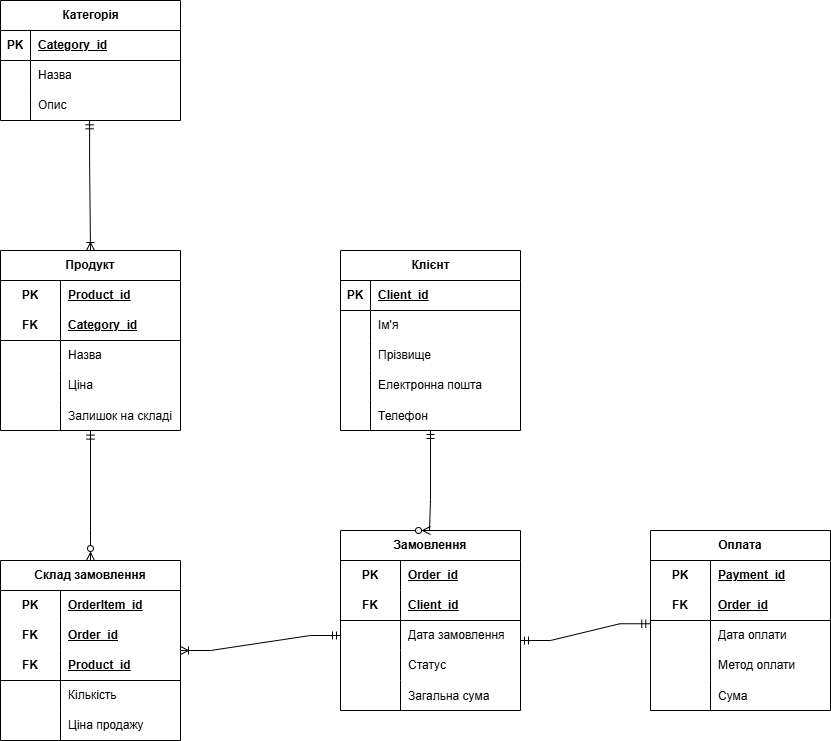

# Лабораторна робота 1: Збір вимог та розробка схеми ER
### Тема: 
Розроблення бази даних для застосунку моніторингу та керування особистих фінансів.
### Мета:
Мета бази заключається у зберіганні інформації від особистих даних до рахунків та транзакцій.
Додатково можливості банкінгового застосунку.
***
### Потреби зацікавлених сторін:
- Адміністратор (Менеджер): вносить дані про нові товари, категорії, керує цінами та контролює залишки на складі.
- Клієнт (Користувач): переглядає каталог, додає товари в кошик, оформлює замовлення та здійснює оплату.
### Дані для зберігання:
Система повинна зберігати інформацію про:
- Клієнтів: особисті дані (ім'я, прізвище), контакти (телефон, email).
- Товари (Продукти): назва, опис, ціна, доступна кількість на складі.
- Категорії: назва категорії та її опис для зручної навігації.
- Замовлення: дата і час оформлення, поточний статус, загальна сума.
- Склад замовлення (Деталі): перелік товарів у конкретному замовленні, їхня кількість та зафіксована ціна продажу.
- Оплату: метод оплати, сума, дата транзакції.
### Бізнес-правила:
1.  Обмеження замовлення:
    - Замовлення не може бути прийняте та оплачене, якщо обрана кількість товару перевищує його залишок на складі.
    - Одне замовлення може містити кілька різних товарів.
2.  Унікальність даних:
    - Кожен клієнт ідентифікується за унікальною електронною адресою (email).
3.	 Перевірка даних (Validation):
    - Поля «Ціна» товару та «Загальна сума» замовлення повинні бути більшими за нуль.
4.  Цілісність зв'язків:
    - Не можна видалити категорію, якщо до неї прив'язані активні товари.
    - Не можна видалити запис про товар, якщо він зафіксований у минулих чи поточних замовленнях клієнтів.
5.  Бізнес-правила системи:
    - Система повинна автоматично розраховувати загальну вартість замовлення на основі обраних позицій та їхньої кількості.
***
### Зображення діаграми ER:

***
### Список сутностей з їхніми атрибутами та пояснення кожного зв'язку прозою:
1. **Клієнти**
   - (PK) Client_id: унікальний ідентифікатор клієнта
   - Ім'я, Прізвище: особисті дані
   - Email: електронна пошта (унікальна)
   - Телефон: контактний номер
2. **Категорія**
   - (PK) Category_id: унікальний ідентифікатор категорії
   - Назва: найменування категорії (наприклад, "Ноутбуки")
   - Опис: короткий опис категорії
3. **Продукт**
   - (PK) Product_id: унікальний ідентифікатор товару
   - (FK) Category_id: посилання на категорію товару
   - Назва: комерційна назва продукту
   - Ціна: базова вартість одиниці товару
   - Залишок на складі: поточна доступна кількість
4. **Замовлення**
   - (PK) Order_id: унікальний номер замовлення
   - (FK) Client_id: посилання на клієнта, який зробив замовлення
   - Дата замовлення: дата і точний час оформлення
   - Статус: поточний стан (обробляється, відправлено, доставлено)
   - Загальна сума: фінальна вартість усього замовлення
5. **Склад замовлення**
   - (PK) OrderItem_id: унікальний ідентифікатор позиції в чеку
   - (FK) Order_id: посилання на номер замовлення
   - (FK) Product_id: посилання на замовлений товар
   - Кількість: скільки штук цього товару замовлено
   - Ціна продажу: ціна товару на момент фіксації замовлення
6. **Оплата**
   - (PK) Payment_id: унікальний номер транзакції
   - (FK) Order_id: посилання на оплачене замовлення
   - Дата оплати: час проведення транзакції
   - Метод оплати: картка, готівка при отриманні тощо
   - Сума: фактично сплачена сума
***
### Пояснення зв'язків між сутностями:
- Клієнт - Замовлення: зв'язок "один до багатьох". Один клієнт може зробити багато замовлень, але кожне конкретне замовлення належить лише одному унікальному клієнтові.
- Категорія - Продукт: зв'язок "один до багатьох". Одна категорія може містити багато товарів, але кожен продукт належить суворо до однієї категорії.
- Замовлення - Склад Замовлення - Продукт: реалізація зв'язку "багато до багатьох". В одному замовленні може бути багато різних продуктів, і один і той самий продукт може зустрічатися в багатьох різних замовленнях. Проміжна сутність "Склад Замовлення" фіксує, скільки саме одиниць конкретного товару було придбано в рамках конкретного чека.
- Замовлення - Оплата: зв'язок "один до одного". Кожне замовлення має одну успішну транзакцію оплати.
***
### Припущення та обмеження:
1.  Унікальність позицій у чеку: полягає в тому, що клієнт не може мати два окремих записи одного й того ж товару в межах одного замовлення. Замість цього використовується поле «Кількість» (Quantity) у таблиці «Склад Замовлення».
2.  Фіксація ціни: ми припускаємо, що ціни на товари можуть змінюватися з часом. Тому в таблиці «Склад Замовлення» зберігається атрибут «Ціна продажу» (PriceAtPurchase), який фіксує вартість товару саме на момент покупки, щоб зміна ціни в каталозі не вплинула на історію старих замовлень.
3.  Обмеження прав доступу: клієнти не мають права редагувати перелік доступних товарів (каталог), змінювати ціни або переглядати історію замовлень та особисті дані інших користувачів.
