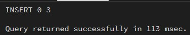
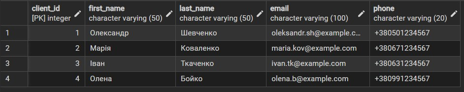
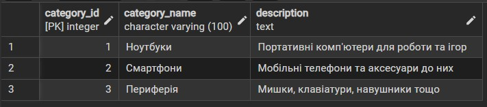
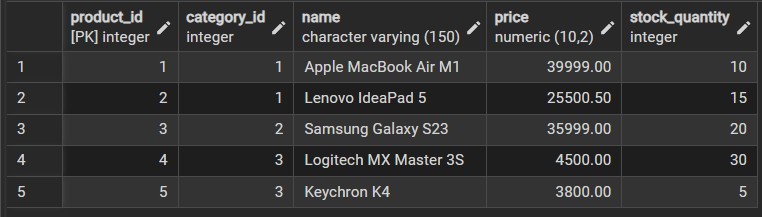
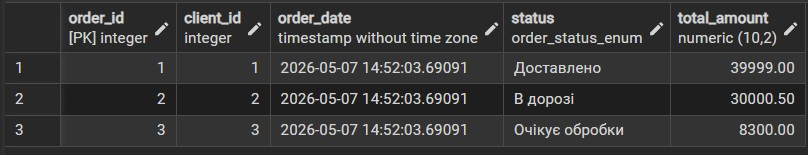
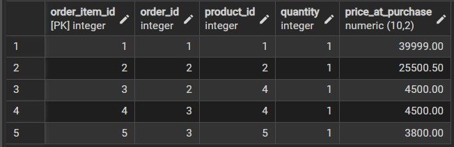
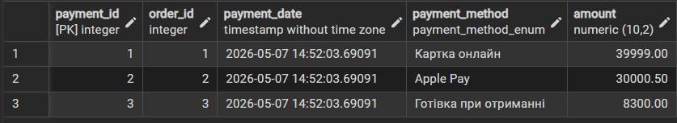

# Лабораторна робота 2: Перетворення ER-діаграми на схему PostgreSQL
## Цілі:
1. Написати SQL DDL-інструкції для створення кожної таблиці з вашої ERD в PostgreSQL.
2. Вказати відповідні типи даних для кожного стовпця, вибрати первинний ключ для кожної таблиці та визначити будь-які необхідні зовнішні ключі, обмеження UNIQUE, NOT NULL, CHECK або DEFAULT.
3. Вставити зразки рядків (принаймні 3–5 рядків на таблицю) за допомогою INSERT INTO.
4. Протестувати все в pgAdmin (або іншому клієнті PostgreSQL), щоб переконатися, що таблиці та дані завантажуються правильно.
***
## Результат:
### 1. SQL DDL-інструкції для створення таблиць. + 2. Вказані відповідні типи даних для кожного стовпця, вибрати первинні ключі та зовнішні ключі, обмеження.
```sql
DO $$
BEGIN
  IF NOT EXISTS (SELECT 1 FROM pg_type WHERE typname = 'order_status_enum') THEN
      CREATE TYPE order_status_enum AS ENUM ('Очікує обробки', 'Оплачено', 'В дорозі', 'Доставлено', 'Скасовано');
  END IF;
END$$;

DO $$
BEGIN
  IF NOT EXISTS (SELECT 1 FROM pg_type WHERE typname = 'payment_method_enum') THEN
      CREATE TYPE payment_method_enum AS ENUM ('Картка онлайн', 'Apple Pay', 'Google Pay', 'Готівка при отриманні');
  END IF;
END$$;

CREATE TABLE IF NOT EXISTS customers (
    client_id SERIAL PRIMARY KEY,
    first_name VARCHAR(50) NOT NULL,
    last_name VARCHAR(50) NOT NULL,
    email VARCHAR(100) UNIQUE NOT NULL CHECK (email ~* '^[A-Za-z0-9._%+-]+@[A-Za-z0-9.-]+\.[A-Za-z]{2,}$'),
    phone VARCHAR(20) UNIQUE
);

CREATE TABLE IF NOT EXISTS categories (
    category_id SERIAL PRIMARY KEY,
    category_name VARCHAR(100) NOT NULL,
    description TEXT
);

CREATE TABLE IF NOT EXISTS products (
    product_id SERIAL PRIMARY KEY,
    category_id INTEGER NOT NULL REFERENCES categories(category_id) ON DELETE RESTRICT,
    name VARCHAR(150) NOT NULL,
    price NUMERIC(10, 2) NOT NULL CHECK (price > 0),
    stock_quantity INTEGER NOT NULL DEFAULT 0 CHECK (stock_quantity >= 0)
);

CREATE TABLE IF NOT EXISTS orders (
    order_id SERIAL PRIMARY KEY,
    client_id INTEGER NOT NULL REFERENCES customers(client_id) ON DELETE RESTRICT,
    order_date TIMESTAMP NOT NULL DEFAULT CURRENT_TIMESTAMP,
    status order_status_enum NOT NULL DEFAULT 'Очікує обробки',
    total_amount NUMERIC(10, 2) NOT NULL CHECK (total_amount >= 0)
);

CREATE TABLE IF NOT EXISTS order_items (
    order_item_id SERIAL PRIMARY KEY,
    order_id INTEGER REFERENCES orders(order_id) ON DELETE CASCADE,
    product_id INTEGER REFERENCES products(product_id) ON DELETE RESTRICT,
    quantity INTEGER NOT NULL CHECK (quantity > 0),
    price_at_purchase NUMERIC(10, 2) NOT NULL CHECK (price_at_purchase > 0)
);

CREATE TABLE IF NOT EXISTS payments (
    payment_id SERIAL PRIMARY KEY,
    order_id INTEGER UNIQUE REFERENCES orders(order_id) ON DELETE CASCADE,
    payment_date TIMESTAMP NOT NULL DEFAULT CURRENT_TIMESTAMP,
    payment_method payment_method_enum NOT NULL,
    amount NUMERIC(10, 2) NOT NULL CHECK (amount > 0)
);
```
> **_Опис стовпців та ключів:_**
>
> **customers**
>
> - `client_id` - *SERIAL PRIMARY KEY,* серійний (йде по порядку) первинний ключ для ідентифікатора клієнта, не може не існувати.
> - `first_name` - *VARCHAR(50),* короткий текст на 50 символів для імені, не може не існувати.
> - `last_name` - *VARCHAR(50),* короткий текст на 50 символів для прізвища, не може не існувати.
> - `email` - *VARCHAR(100),* короткий текст для електронної пошти, унікальний, містить регулярний вираз для валідації формату пошти, не може не існувати.
> - `phone` - *VARCHAR(20),* короткий текст для номера телефону, унікальний.
>
> **categories**
> 
> - `category_id` - *SERIAL PRIMARY KEY,* серійний первинний ключ для ідентифікатора категорії, не може не існувати.
> - `category_name` - *VARCHAR(100),* короткий текст для назви категорії, не може не існувати.
> - `description` - *TEXT,* довгий текст для опису категорії.
>
> **products**
>
> - `product_id` - *SERIAL PRIMARY KEY,* серійний первинний ключ для ідентифікатора товару, не може не існувати.
> - `category_id` - *INTEGER,* ціле число, ідентифікатор категорії, посилається на categories(category_id), правило ON DELETE RESTRICT забороняє видалення категорії з товарами, не може не існувати.
> - `name` - *VARCHAR(150),* короткий текст для назви товару, не може не існувати.
> - `price` - *NUMERIC(10,2),* не ціле число для ціни (до копійок), не може не існувати, має бути більше нуля.
> - `stock_quantity` - *INTEGER,* ціле число для залишку на складі, за замовчуванням 0, не може бути від'ємним.
>
> **orders**
>
> - `order_id` - *SERIAL PRIMARY KEY,* серійний первинний ключ для ідентифікатора замовлення, не може не існувати.
> - `client_id` - *INTEGER,* ціле число, ідентифікатор клієнта, посилається на customers(client_id), правило ON DELETE RESTRICT захищає від видалення клієнтів з історією замовлень, не може не існувати.
> - `order_date` - *TIMESTAMP,* дата + час оформлення, за замовчуванням поточний час, не може не існувати.
> - `status` - *order_status_enum,* користувацький тип (перелічення) для статусу, за замовчуванням 'Очікує обробки', не може не існувати.
> - `total_amount` - *NUMERIC(10,2),* сума замовлення, не може не існувати, має бути більше або дорівнювати нулю.
>
> **order_items**
>
> - `order_item_id` - *SERIAL PRIMARY KEY,* сурогатний серійний первинний ключ для деталі замовлення, не може не існувати.
> - `order_id` - *INTEGER,* ідентифікатор замовлення, посилається на orders(order_id), правило ON DELETE CASCADE автоматично видаляє деталі при видаленні замовлення.
> - `product_id` - *INTEGER,* ідентифікатор товару, посилається на products(product_id), правило ON DELETE RESTRICT захищає замовлений товар від видалення.
> - `quantity` - *INTEGER,* кількість товару, не може не існувати, має бути більше нуля.
> - `price_at_purchase` - *NUMERIC(10,2),* зафіксована ціна на момент покупки, має бути більше нуля.
> 
> **payments**
>
> - `payment_id` - *SERIAL PRIMARY KEY,* серійний первинний ключ для ідентифікатора транзакції, не може не існувати.
> - `order_id` - *INTEGER,* унікальний ідентифікатор замовлення (одна оплата на одне замовлення), посилається на orders(order_id) з каскадним видаленням.
> - `payment_date` - *TIMESTAMP,* дата + час транзакції, за замовчуванням поточний час, не може не існувати.
> - `payment_method` - *payment_method_enum,* користувацький тип для способу оплати, не може не існувати.
> - `amount` - *NUMERIC(10,2),* фактично сплачена сума, не може не існувати, має бути більше нуля.
### Результат створення таблиць:
i. 
ii. 
***
### 3. Вставити зразки рядків (принаймні 3–5 рядків на таблицю) за допомогою `INSERT INTO`.
```sql
INSERT INTO customers (first_name, last_name, email, phone) VALUES
    ('Олександр', 'Шевченко', 'oleksandr.sh@example.com', '+380501234567'),
    ('Марія', 'Коваленко', 'maria.kov@example.com', '+380671234567'),
    ('Іван', 'Ткаченко', 'ivan.tk@example.com', '+380631234567'),
    ('Олена', 'Бойко', 'olena.b@example.com', '+380991234567');

INSERT INTO categories (category_name, description) VALUES
    ('Ноутбуки', 'Портативні комп''ютери для роботи та ігор'),
    ('Смартфони', 'Мобільні телефони та аксесуари до них'),
    ('Периферія', 'Мишки, клавіатури, навушники тощо');

INSERT INTO products (category_id, name, price, stock_quantity) VALUES
    (1, 'Apple MacBook Air M1', 39999.00, 10),
    (1, 'Lenovo IdeaPad 5', 25500.50, 15),
    (2, 'Samsung Galaxy S23', 35999.00, 20),
    (3, 'Logitech MX Master 3S', 4500.00, 30),
    (3, 'Keychron K4', 3800.00, 5);

INSERT INTO orders (client_id, status, total_amount) VALUES
    (1, 'Доставлено', 39999.00),
    (2, 'В дорозі', 30000.50),
    (3, 'Очікує обробки', 8300.00);

INSERT INTO order_items (order_id, product_id, quantity, price_at_purchase) VALUES
    (1, 1, 1, 39999.00),
    (2, 2, 1, 25500.50),
    (2, 4, 1, 4500.00),
    (3, 4, 1, 4500.00),
    (3, 5, 1, 3800.00);

INSERT INTO payments (order_id, payment_method, amount) VALUES
    (1, 'Картка онлайн', 39999.00),
    (2, 'Apple Pay', 30000.50),
    (3, 'Готівка при отриманні', 8300.00);
```
### Результат вставлення:

***
### 4. Протестувати все в pgAdmin (або іншому клієнті PostgreSQL), щоб переконатися, що таблиці та дані завантажуються правильно.
#### customers:

#### categories:

#### products:

#### orders:

#### order_items:

#### payments:

