# Лабораторна робота 3: Маніпулювання даними SQL (OLTP)
## Цілі:
1. Написати запити `SELECT` для отримання даних (включаючи фільтрацію за допомогою `WHERE` та вибір певних стовпців).
2. Практикувати використання операторів `INSERT` для додавання нових рядків до таблиць.
3. Практикувати використання оператора `UPDATE` для зміни існуючих рядків (використовуючи `SET` та `WHERE`).
4. Практикувати використання операторів `DELETE` для безпечного видалення рядків (за допомогою `WHERE`).
5. Вивчити основні операції маніпулювання даними (DML) у PostgreSQL та спостерігати за їхнім впливом.
***
## 1. Написати запити `SELECT` для отримання даних (включаючи фільтрацію за допомогою `WHERE` та вибір певних стовпців).
### Отримання імен та прізвищ клієнтів, у яких номер телефону починається на '+38050':
```sql
SELECT first_name, last_name, phone FROM customers WHERE phone LIKE '+38050%';
```
> Очікування: клієнт Олександр Шевченко з відповідним номером.
### Результат:
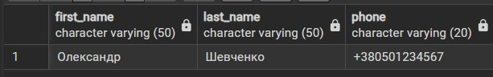

### Вивід назви та ціни товарів, вартість яких перевищує 20000:
```sql
SELECT name, price FROM products WHERE price > 20000;
```
> Очікування: Apple MacBook Air M1, Lenovo IdeaPad 5, Samsung Galaxy S23.
### Результат:
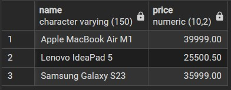

### Вивід замовлень (ідентифікатор, дата, сума), що мають статус 'В дорозі':
```sql
SELECT order_id, order_date, total_amount FROM orders WHERE status = 'В дорозі';
```
> Очікування: замовлення з id 2 на суму 30000.50.
### Результат:
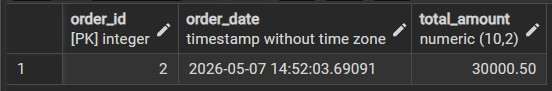

### Вивід деталей замовлень, де ціна продажу товару менша за 5000:
```sql
SELECT order_id, product_id, quantity, price_at_purchase FROM order_items WHERE price_at_purchase < 5000;
```
> Очікування: позиції з товарами Logitech MX Master 3S та Keychron K4.
### Результат:
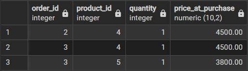

### Вивід методів оплати та сум для транзакцій, більших за 10000:
```sql
SELECT payment_method, amount FROM payments WHERE amount > 10000;
```
> Очікування: оплати на 39999.00 (Картка онлайн) та 30000.50 (Apple Pay).
### Результат:
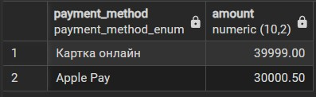

## 2. Практикувати використання операторів INSERT для додавання нових рядків до таблиць.
### Додавання нового клієнта.
```sql
INSERT INTO customers (first_name, last_name, email, phone)
VALUES ('Петро', 'Дорошенко', 'petro.d@example.com', '+380731112233');

SELECT * FROM customers;
```
> Очікування: поява нового клієнта з id 5.
### Результат:
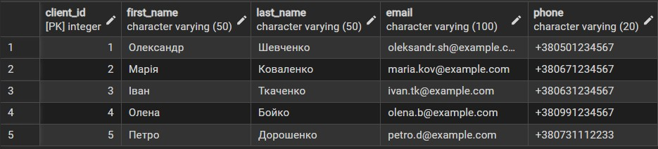

### Додавання нової категорії.
```sql
INSERT INTO categories (category_name, description)
VALUES ('Планшети', 'Планшетні комп''ютери та електронні книги');

SELECT * FROM categories;
```
> Очікування: поява категорії "Планшети" з id 4.
### Результат:
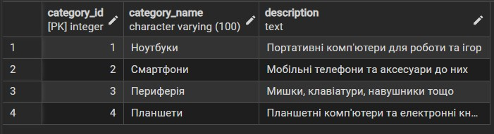

### Додавання нового товару.
```sql
INSERT INTO products (category_id, name, price, stock_quantity)
VALUES (4, 'Apple iPad Air', 25000.00, 12);

SELECT * FROM products;
```
> Очікування: поява нового товару в категорії планшетів.
### Результат:
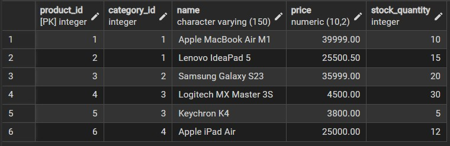

### Додавання нового замовлення.
```sql
INSERT INTO orders (client_id, status, total_amount)
VALUES (5, 'Очікує обробки', 25000.00);

SELECT * FROM orders;
```
> Очікування: створення нового замовлення для клієнта Петра Дорошенка.
### Результат:
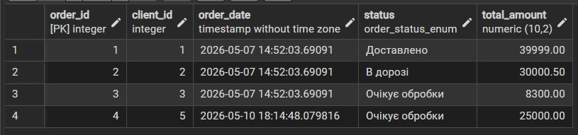

### Додавання деталей нового замовлення (склад замовлення).
```sql
INSERT INTO order_items (order_id, product_id, quantity, price_at_purchase)
VALUES (4, 6, 1, 25000.00);

SELECT * FROM order_items;
```
> Очікування: додавання купленого iPad Air до замовлення номер 4.
### Результат:
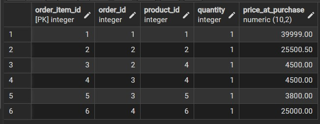

### Додавання нової оплати.
```sql
INSERT INTO payments (order_id, payment_method, amount)
VALUES (4, 'Google Pay', 25000.00);

SELECT * FROM payments;
```
> Очікування: фіксація успішної транзакції для замовлення 4.
### Результат:
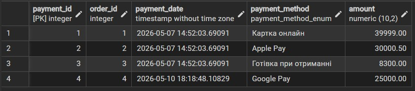

## 3. Практикувати використання оператора UPDATE для зміни існуючих рядків (використовуючи SET та WHERE).
### Зміна номера телефону клієнта.
```sql
UPDATE customers
SET phone = '+380739998877'
WHERE email = 'petro.d@example.com';

SELECT * FROM customers;
```
> Очікування: оновлення номера телефону у Петра Дорошенка.
### Результат:
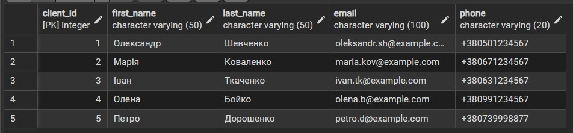

### Зміна опису категорії.
```sql
UPDATE categories
SET description = 'Оновлений опис: тільки сучасні планшети'
WHERE category_name = 'Планшети';

SELECT * FROM categories;
```
> Очікування: зміна текстового опису для категорії з id 4.
### Результат:
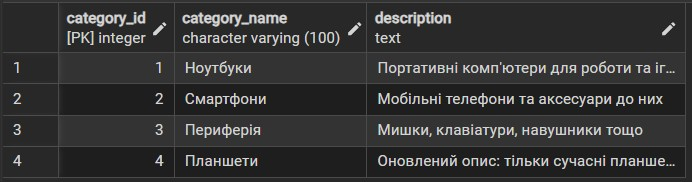

### Зміна залишку товару на складі.
```sql
UPDATE products
SET stock_quantity = 10
WHERE name = 'Apple iPad Air';

SELECT * FROM products;
```
> Очікування: зменшення кількості доступних iPad Air до 10 штук.
### Результат:
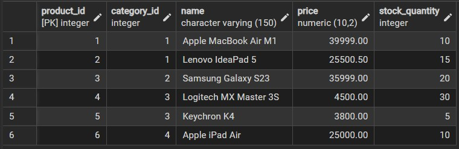

### Зміна статусу замовлення.
```sql
UPDATE orders
SET status = 'Оплачено'
WHERE order_id = 4;

SELECT * FROM orders;
```
> Очікування: перехід замовлення 4 зі статусу 'Очікує обробки' до 'Оплачено'.
### Результат:
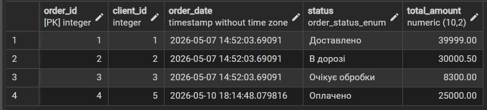

### Зміна ціни продажу в деталях замовлення (наприклад, застосовано знижку).
```sql
UPDATE order_items
SET price_at_purchase = 23000.00
WHERE order_id = 4 AND product_id = 6;

SELECT * FROM order_items;
```
> Очікування: оновлення зафіксованої ціни у чеку.
### Результат:
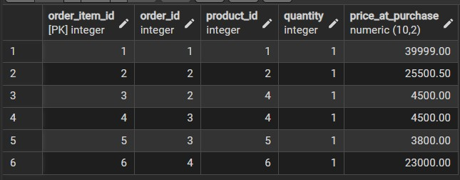

### Зміна суми транзакції (відповідно до знижки).
```sql
UPDATE payments
SET amount = 23000.00
WHERE order_id = 4;

SELECT * FROM payments;
```
> Очікування: зміна суми оплати на 23000.00.
### Результат:
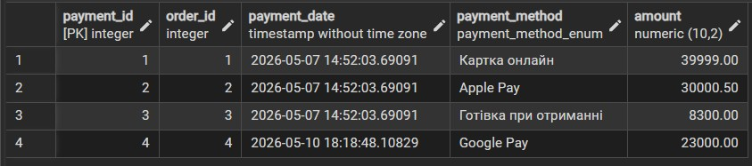

## 4. Практикувати використання операторів DELETE для безпечного видалення рядків (за допомогою WHERE).
### Видалення транзакції оплати.
```sql
DELETE FROM payments
WHERE order_id = 4;

SELECT * FROM payments;
```
> Очікування: видалення запису про оплату 4-го замовлення.
### Результат:
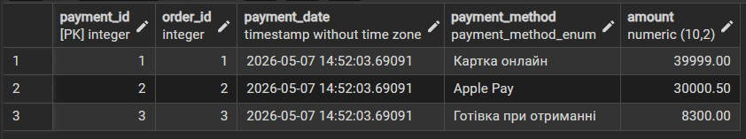

### Видалення деталей замовлення.
```sql
DELETE FROM order_items
WHERE order_id = 4;

SELECT * FROM order_items;
```
> Очікування: очищення складу товарів для замовлення 4.
### Результат:
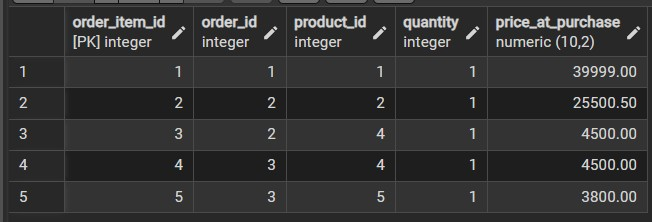

### Видалення самого замовлення.
```sql
DELETE FROM orders
WHERE order_id = 4;

SELECT * FROM orders;
```
> Очікування: повне видалення 4-го замовлення з бази.
### Результат:
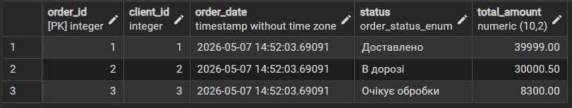

### Видалення товару.
```sql
DELETE FROM products
WHERE name = 'Apple iPad Air';

SELECT * FROM products;
```
> Очікування: видалення товару, який ми додавали у пункті 2.
### Результат:
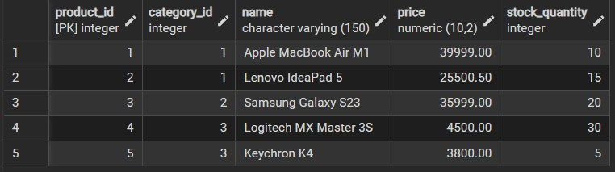

### Видалення категорії.
```sql
DELETE FROM categories
WHERE category_name = 'Планшети';

SELECT * FROM categories;
```
> Очікування: видалення категорії, оскільки в ній більше немає товарів.
### Результат:
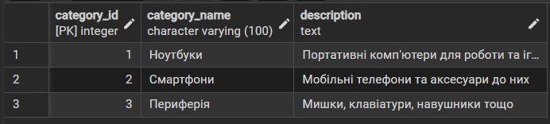

### Видалення клієнта.
```sql
DELETE FROM customers
WHERE email = 'petro.d@example.com';

SELECT * FROM customers;
```
> Очікування: видалення клієнта Петра Дорошенка, оскільки у нього немає активних замовлень.
### Результат:
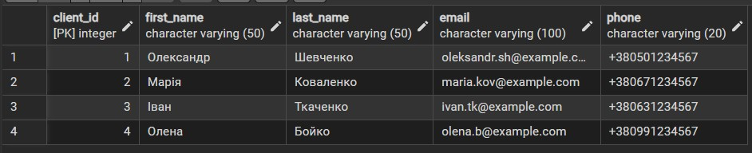

## 5. Вивчити основні операції маніпулювання даними (DML) у PostgreSQL та спостерігати за їхнім впливом.
> У результаті лабораторної роботи були вивчені основні операції маніпулювання даними (DML) для схеми інтернет-магазину. Було успішно протестовано оператори `SELECT`, `INSERT`, `UPDATE` та `DELETE`. Також на практиці підтверджено роботу обмежень зовнішніх ключів при видаленні чи оновленні пов'язаних записів. База даних коректно обробляє транзакційні запити OLTP-типу.
