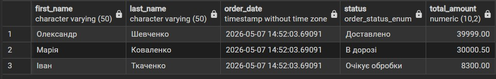
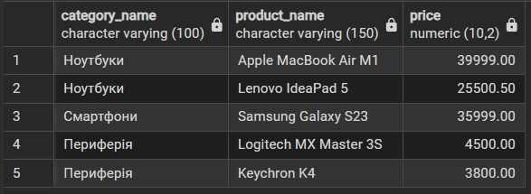
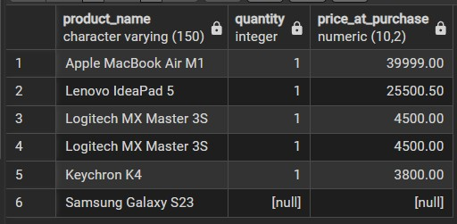
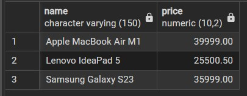
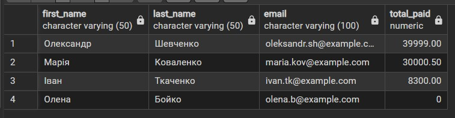
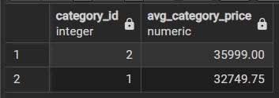

# Лабораторна робота 4: Аналітичні SQL-запити (OLAP)
## Цілі:
1. Використовувати агрегатні функції, такі як COUNT, SUM, AVG, MIN та MAX, для обчислення зведеної статистики з ваших даних.
2. Написати запити GROUP BY для групування рядків за одним або кількома стовпцями та обчислення агрегатів для кожної групи.
3. Використовувати HAVING для фільтрації результатів згрупованих запитів на основі агрегованих умов.
4. Виконувати операції JOIN (принаймні INNER JOIN та LEFT JOIN), щоб об'єднати дані з кількох таблиць.
5. Створювати об'єднані запити на агрегацію для кількох таблиць, які об'єднують таблиці та створюють згрупований, агрегований вивід.
6. Інтерпретувати результати ваших запитів та пояснити, що робить кожен з них.
***
## 1. Використовувати агрегатні функції, такі як COUNT, SUM, AVG, MIN та MAX, для обчислення зведеної статистики з ваших даних. + 2. Написати запити GROUP BY для групування рядків за одним або кількома стовпцями та обчислення агрегатів для кожної групи.
> мінімум 4 запити, що містять агрегаційні функції (SUM, AVG, COUNT, MIN, MAX, GROUP BY)
### Приклад 1 (Кількість замовлень у кожного з клієнтів):
```sql
SELECT client_id, COUNT(order_id) AS total_orders
FROM orders 
GROUP BY client_id;
```
> Запит показує загальну кількість замовлень, тобто `COUNT(order_id)`, у стовпці з назвою `total_orders`, тобто   `AS total_orders`, для кожного клієнта за допомогою згрупування `GROUP BY client_id`.
## Результат:


## Приклад 2 (Загальна сума доходу за кожним статусом замовлення):
```sql
SELECT status, SUM(total_amount) AS expected_revenue
FROM orders 
GROUP BY status;
```
> Запит показує загальну суму грошей з усіх замовлень, тобто `SUM(total_amount)`, у стовпці з назвою `expected_revenue`, тобто `AS expected_revenue`, згруповану за кожним поточним статусом замовлення `GROUP BY status`.
## Результат:


## Приклад 3 (Мінімальна, максимальна та середня ціна товарів у магазині):
```sql
SELECT MIN(price) AS min_price, 
MAX(price) AS max_price, 
ROUND(AVG(price), 2) AS avg_price
FROM products;
```
> Запит обчислює найдешевшу ціну `MIN(price)`, найдорожчу `MAX(price)` та середню вартість товару в каталозі `ROUND(AVG(price)`, 2) з округленням до двох знаків після коми. Виводить результати у відповідних стовпцях `min_price`, `max_price` та `avg_price`.
## Результат:


## Приклад 4 (Кількість проданих одиниць для кожного товару, але тільки якщо продано більше 1 штуки):
```sql
SELECT product_id, SUM(quantity) AS total_sold
FROM order_items 
GROUP BY product_id
HAVING SUM(quantity) > 1;
```
> Запит рахує загальну кількість проданих одиниць `SUM(quantity) AS total_sold` для кожного товару за допомогою `GROUP BY product_id`. Але виводяться лише ті товари, яких було замовлено загалом більше однієї штуки, завдяки умові `HAVING SUM(quantity) > 1`.
## Результат:

***
## 3. Виконувати операції JOIN (принаймні INNER JOIN та LEFT JOIN), щоб об'єднати дані з кількох таблиць.
> мінімум 3 запити, що використовують різні типи джоінів (INNER JOIN, LEFT JOIN, RIGHT JOIN, FULL JOIN, CROSS JOIN)
## Приклад 1 (Вивід деталей замовлень разом з іменами клієнтів):
```sql
SELECT c.first_name, c.last_name, o.order_date, o.status, o.total_amount
FROM customers c
INNER JOIN orders o ON c.client_id = o.client_id;
```
> Запит поєднує таблицю клієнтів і таблицю замовлень. `INNER JOIN` виводить інформацію лише про тих клієнтів, які зробили хоча б одне замовлення. Об'єднання відбувається за умови збігу ідентифікаторів: `ON c.client_id = o.client_id`.
## Результат:


## Приклад 2 (Вивід усіх категорій та товарів у них або значення NULL, якщо в категорії немає товарів):
```sql
SELECT c.category_name, p.name AS product_name, p.price
FROM categories c
LEFT JOIN products p ON c.category_id = p.category_id;
```
> Запит показує всі значення з лівої таблиці, тобто абсолютно всі існуючі категорії `categories c`, та відповідні товари до них `LEFT JOIN products p`. Якщо категорія існує (наприклад, "Планшети"), але товарів у ній ще немає, замість назви товару та ціни буде виведено значення `NULL`.
## Результат:


## Приклад 3 (Вивід усіх товарів та інформації про їх продаж у чеках, або NULL, якщо товар жодного разу не замовляли):
```sql
SELECT p.name AS product_name, oi.quantity, oi.price_at_purchase
FROM order_items oi
RIGHT JOIN products p ON oi.product_id = p.product_id;
```
> `RIGHT JOIN` виводить усі значення з правої таблиці `products p`, тобто весь каталог магазину, і приєднує до них деталі з чеків замовлень `order_items oi`. Якщо якийсь товар жодного разу не замовляли, поля `quantity` та `price_at_purchase` для нього матимуть значення `NULL`.
## результат:

***

## 4. Використання підзапитів.
> мінімум 3 запити з використанням підзапитів (вибірка з підзапитом у SELECT, WHERE, або HAVING)
## Приклад 1 (Вивід товарів, ціна яких вища за середню ціну всіх товарів у каталозі):
```sql
SELECT name, price
FROM products
WHERE price > (SELECT AVG(price) FROM products);
```
> Запит показує назви та ціни тих товарів, чия вартість більша за показник середньої ціни. Спочатку обчислюється підзапит `(SELECT AVG(price) FROM products)`, а потім головний запит фільтрує каталог`WHERE price > ...`.
## Результат:


## Приклад 2 (Вивід списку клієнтів та загальної суми, яку кожен з них успішно оплатив):
```sql
SELECT c.first_name, c.last_name, c.email,
    (SELECT COALESCE(SUM(p.amount), 0) 
     FROM payments p
     INNER JOIN orders o ON p.order_id = o.order_id
     WHERE o.client_id = c.client_id) AS total_paid
FROM customers c;
```
> Запит виводить імена клієнтів та генерує новий стовпець `total_paid` за допомогою підзапиту в розділі `SELECT`. Підзапит шукає всі успішні оплати `payments`, приєднує до них `orders`, щоб визначити, кому належить оплата `WHERE o.client_id = c.client_id`, та сумує їх. `COALESCE(..., 0)` поверне 0, якщо клієнт ще нічого не купував.
## Результат:


## Приклад 3 (Вивід ідентифікаторів категорій, у яких середня ціна товару вища за середню ціну товару по всьому магазину):
```sql
SELECT category_id, ROUND(AVG(price), 2) AS avg_category_price
FROM products
GROUP BY category_id
HAVING AVG(price) > (SELECT AVG(price) FROM products);
```
> Запит рахує середню ціну товарів всередині кожної категорії `GROUP BY category_id`. Умова `HAVING` містить підзапит `(SELECT AVG(price) FROM products)`, що обчислює глобальну середню ціну. У результаті виводяться лише ті категорії, які в середньому пропонують товари дорожчі за загальний показник.
## Результат:

