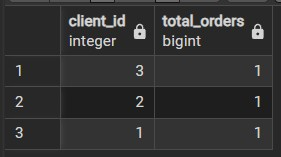
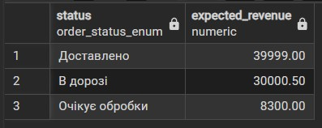
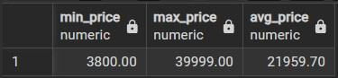
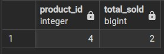

# Лабораторна робота 4: Аналітичні SQL-запити (OLAP)
## Цілі:
1. Використовувати агрегатні функції, такі як COUNT, SUM, AVG, MIN та MAX, для обчислення зведеної статистики з ваших даних.
2. Написати запити GROUP BY для групування рядків за одним або кількома стовпцями та обчислення агрегатів для кожної групи.
3. Використовувати HAVING для фільтрації результатів згрупованих запитів на основі агрегованих умов.
4. Виконувати операції JOIN (принаймні INNER JOIN та LEFT JOIN), щоб об'єднати дані з кількох таблиць.
5. Створювати об'єднані запити на агрегацію для кількох таблиць, які об'єднують таблиці та створюють згрупований, агрегований вивід.
6. Інтерпретувати результати ваших запитів та пояснити, що робить кожен з них.
***
## 1. Використовувати агрегатні функції, такі як COUNT, SUM, AVG, MIN та MAX, для обчислення зведеної статистики з ваших даних. + 2. Написати запити GROUP BY для групування рядків за одним або кількома стовпцями та обчислення агрегатів для кожної групи.
> мінімум 4 запити, що містять агрегаційні функції (SUM, AVG, COUNT, MIN, MAX, GROUP BY)
### Приклад 1 (Кількість замовлень у кожного з клієнтів):
```sql
SELECT client_id, COUNT(order_id) AS total_orders
FROM orders 
GROUP BY client_id;
```
> Запит показує загальну кількість замовлень, тобто `COUNT(order_id)`, у стовпці з назвою `total_orders`, тобто   `AS total_orders`, для кожного клієнта за допомогою згрупування `GROUP BY client_id`.
## Результат:


## Приклад 2 (Загальна сума доходу за кожним статусом замовлення):
```sql
SELECT status, SUM(total_amount) AS expected_revenue
FROM orders 
GROUP BY status;
```
> Запит показує загальну суму грошей з усіх замовлень, тобто `SUM(total_amount)`, у стовпці з назвою `expected_revenue`, тобто `AS expected_revenue`, згруповану за кожним поточним статусом замовлення `GROUP BY status`.
## Результат:


## Приклад 3 (Мінімальна, максимальна та середня ціна товарів у магазині):
```sql
SELECT MIN(price) AS min_price, 
MAX(price) AS max_price, 
ROUND(AVG(price), 2) AS avg_price
FROM products;
```
> Запит обчислює найдешевшу ціну `MIN(price)`, найдорожчу `MAX(price)` та середню вартість товару в каталозі `ROUND(AVG(price)`, 2) з округленням до двох знаків після коми. Виводить результати у відповідних стовпцях `min_price`, `max_price` та `avg_price`.
## Результат:


## Приклад 4 (Кількість проданих одиниць для кожного товару, але тільки якщо продано більше 1 штуки):
```sql
SELECT product_id, SUM(quantity) AS total_sold
FROM order_items 
GROUP BY product_id
HAVING SUM(quantity) > 1;
```
> Запит рахує загальну кількість проданих одиниць `SUM(quantity) AS total_sold` для кожного товару за допомогою `GROUP BY product_id`. Але виводяться лише ті товари, яких було замовлено загалом більше однієї штуки, завдяки умові `HAVING SUM(quantity) > 1`.
## Результат:

***
## 3. Виконувати операції JOIN (принаймні INNER JOIN та LEFT JOIN), щоб об'єднати дані з кількох таблиць.
> мінімум 3 запити, що використовують різні типи джоінів (INNER JOIN, LEFT JOIN, RIGHT JOIN, FULL JOIN, CROSS JOIN)
## 1
